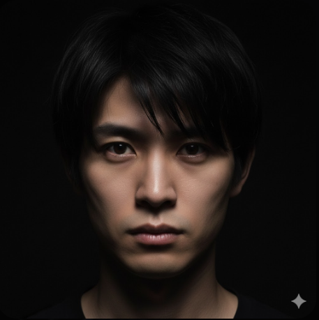
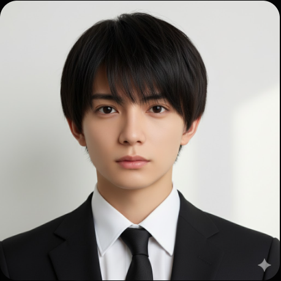
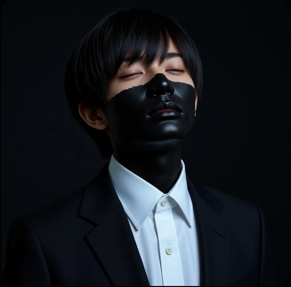
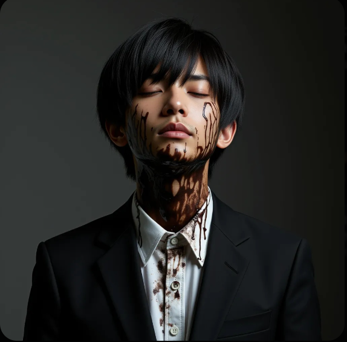
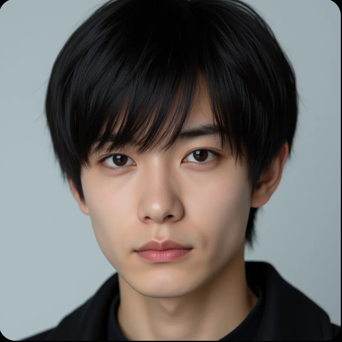
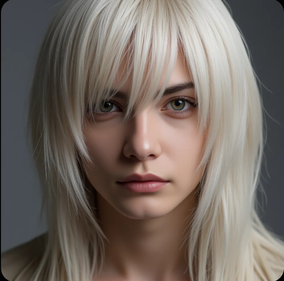
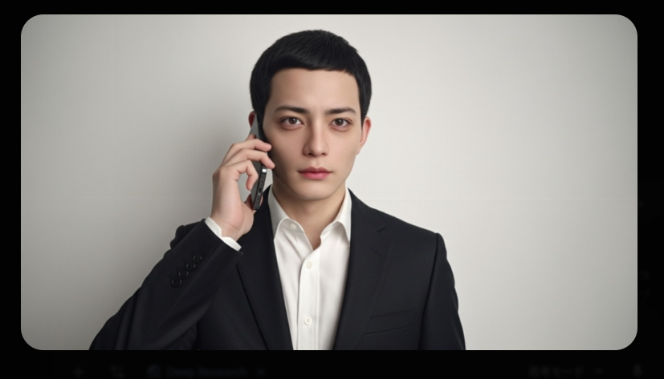
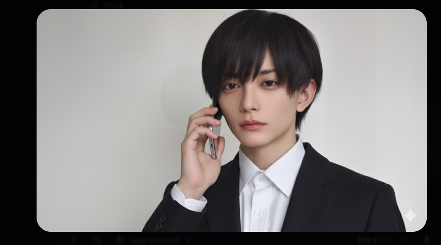

# Before/After 画像ギャラリー — HALUCINATION

LoRA学習・AI画像生成の試行錯誤で生じた問題と改善を、実際の生成画像で記録する。
詳細な教訓・解説は [`lora-overfitting.md`](./lora-overfitting.md) を参照。

---

## 一覧

| # | カテゴリ | Before（失敗）| After（成功・改善）| 教訓 |
|---|---|---|---|---|
| 1 | Gemini データセット生成 | `pair1_before_gemini_dataset_wrong_person.png` | `pair1_after_gemini_dataset_correct_person.png` | Geminiは照明・背景条件を変えると別人を生成する |
| 2 | 黒塗り表現（LoRA過学習）| `pair2_before_lora_black_paint_partial_fail.png` | `pair2_after_lora_organic_texture_improved.png` | "black paint" より "organic mass / charred" で生々しい質感が出る |
| 3 | LoRA崩壊（lora_scale）| `pair3_before_lora_correct_face.png` | `pair3_after_lora_breakdown_wrong_person.png` | lora_scale < 0.75 で白髪西洋人の別人に完全崩壊 |
| 4 | 顔一貫性（LoRAなし）| `pair4_before_gemini_phone_wrong_person.png` | `pair4_after_gemini_phone_correct_face.png` | LoRAなしのツールは同じプロンプトでも毎回別人が出る |

---

## pair1: Geminiデータセット — 別人 vs 正しい人物

LoRA学習データセット（31枚）の多様性セット作成時、Geminiが全く別の人物を生成した事例。

| Before（失敗） | After（成功）|
|---|---|
|  |  |
| より成熟した顔立ち・顎周りがはっきりした男性。主人公の特徴を全く持たない | 白背景・黒スーツ白シャツ・正しい若い顔立ち |

**原因**: Gemini は多様な照明・背景を指定するとキャラクターの顔を保持できない。

---

## pair2: 黒塗り表現 — 部分失敗 vs 有機的テクスチャ改善

LoRAの「クリーン画像への過学習」により、顔・服への汚れ演出が困難だった事例。

| Before（失敗）| After（改善）|
|---|---|
|  |  |
| 顎・首周りのみ黒くなり上半分はきれいなまま。白シャツも汚れなし | 頭から黒い液体が垂れるような有機的な質感。大幅改善 |

**キーワード変更**:
- ❌ `black paint`, `tar-like` → 均一できれいな塗布になる
- ✅ `organic mass of meat`, `coagulated`, `charred`, `dried oxidized substance` → 不均一で生々しい質感

---

## pair3: LoRA崩壊 — lora_scale の影響

lora_scale を下げた際に顔が完全に別人に崩壊した事例。

| Before（正常）| After（崩壊）|
|---|---|
|  |  |
| lora_scale=0.85〜1.0。黒スーツ・黒髪・主人公の顔が正確に再現 | 同じLoRAで別パラメータ設定時。白い長髪・西洋人顔の完全別人 |

**教訓**: このLoRAは lora_scale=0.75 未満で別人が出現。使用可能範囲は 0.85〜1.0 のみ。
詳細は `02_prompts/replicate-params.md` を参照。

---

## pair4: 顔一貫性 — LoRAなしツールの不安定さ

電話シーンのプロンプトで、LoRAを使わないツール（Gemini Image）で生成した結果の比較。
同一のプロンプトでも毎回異なる人物が生成される問題を示す。

| Before（失敗）| After（成功）|
|---|---|
|  |  |
| 全く別の人物・短髪・ネクタイあり（キャラクター設定違反）| 主人公に近い顔立ち・ネクタイなし・正しい黒スーツ白シャツ |

**教訓**: LoRAなしでは同じプロンプトを複数回実行しても顔の一貫性は保証されない。
映画全編での顔統一には LoRA（またはフェイススワップ）が必須。

---

## 関連ドキュメント

| ファイル | 内容 |
|---|---|
| `lora-overfitting.md` | 各ペアの詳細な技術解説 |
| `00_knowledge-base/knowledge-base.md` | 事例1（LoRA過学習）の全体像 |
| `02_prompts/replicate-params.md` | LoRA v1〜v5 パラメータ記録 |
| `02_prompts/image-prompts.md` | 有機的テクスチャ表現・マルチステップ生成ワークフロー |
